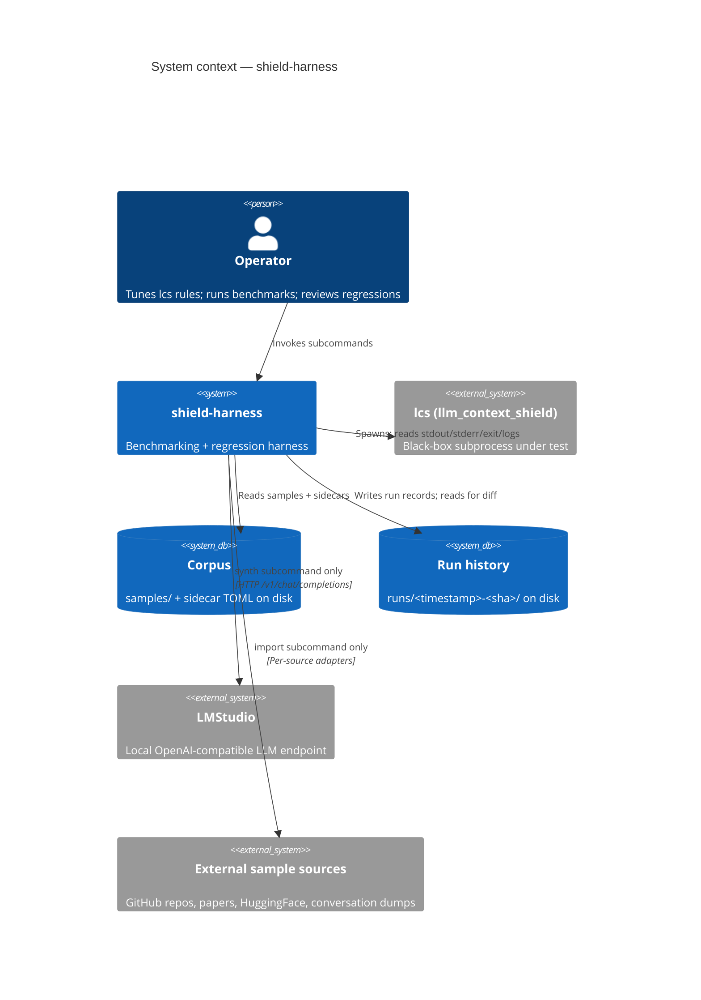
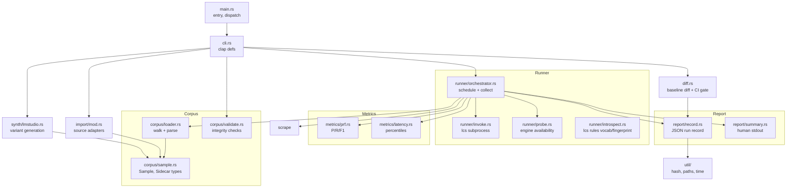
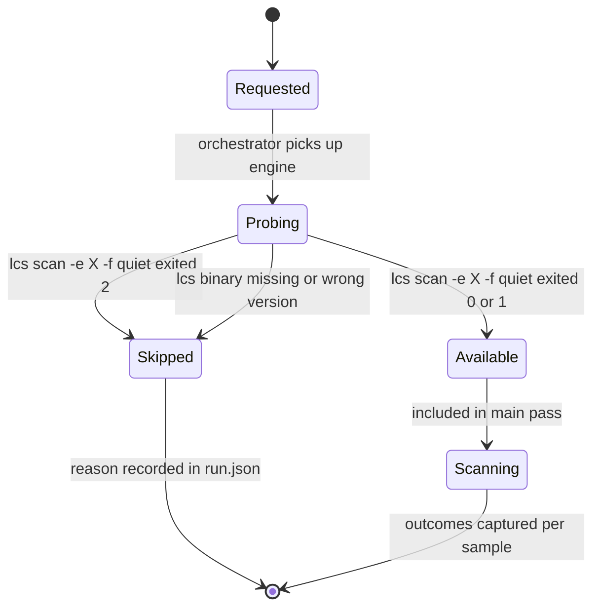
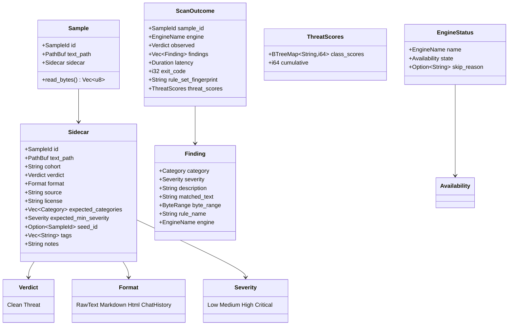
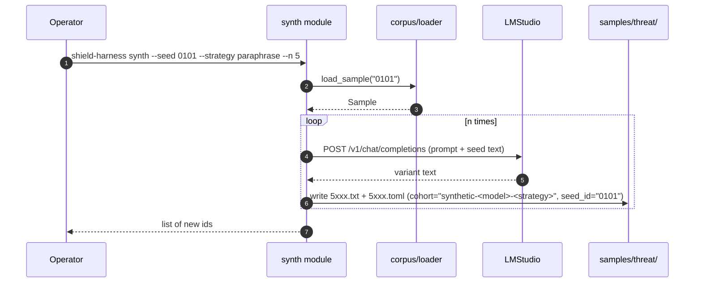
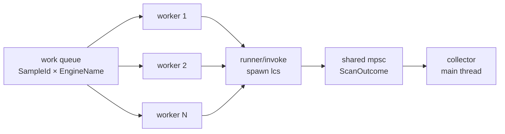

# Architecture — `shield-harness`

**Status:** Living document. Initial draft, derived from [`PRD.md`](PRD.md) on 2026-04-25.

This document describes *how* `shield-harness` is built. The *what* and *why* live in [`PRD.md`](PRD.md). Phase plans and checklists live in [`tasks/TODO.md`](tasks/TODO.md). When the PRD changes, this document is updated to match.

---

## 1. Goals and constraints

Architectural choices flow from a small set of load-bearing PRD constraints. Each row below names the constraint and the design consequence.

| Constraint (PRD ref) | Design consequence |
|---|---|
| External-only integration (§4.1) | All `lcs` interaction is via subprocess. No `llm_context_shield` Cargo dependency. |
| All-engines-by-default with graceful degradation (§3.2) | An *engine availability probe* runs before the main pass against the three engines the lcs CLI exposes (`simple`, `yara`, `syara`). Unavailable engines are recorded as `skipped` and excluded from metrics, never failed. |
| Category vocabulary owned by `lcs` (§3.4) | Vocabulary fetch is wired against lcs ≥ 0.5.2's `lcs rules --categories -e <engine>`. Validator probes the three engines, builds the union, and rejects sidecar `expected_categories` entries outside it (blocking). Per-engine probe failures degrade to non-blocking notices; lcs binary entirely missing is a hard error. |
| Determinism (§4.2) | Stable iteration order (sorted by sample `id`), stable JSON key ordering, percentile-only latency reporting. The per-engine `rule_set_fingerprint` from `ScanReport` is captured into `meta.json` so diffs can distinguish lcs version drift from rule-set drift. |
| Self-supporting (§4.5) | v0.1 blessed dep set is exactly: `serde`, `serde_json`, `toml`, `clap`, `sha2`, `ureq`, `chrono`, `time`, `rayon`, `csv`. Anything beyond this set requires explicit discussion. `chrono` and `time` overlap; `chrono` is the active choice — see §13. |
| Subprocess-only forbids library introspection (§5 non-goal) | Per-rule attribution comes from `findings[].rule_name` and `findings[].engine`, populated directly by lcs ≥ 0.5.2 in every `ScanReport`. Log-scrape is no longer required for attribution. |

## 2. System context



## 3. Module structure

The codebase is organised as a single binary crate (`shield-harness`) with one module per concern. Each file is targeted to stay under 500 lines (per `CLAUDE.md`).



Modules with no inbound arrow are entry points (`main`, `cli`) or leaves (`util`).

## 4. Run pipeline (UC-1)

The default `shield-harness run` workflow.

```mermaid
sequenceDiagram
    autonumber
    participant Op as Operator
    participant CLI as cli + main
    participant Orch as orchestrator
    participant Loader as corpus/loader
    participant Probe as runner/probe
    participant Invoke as runner/invoke
    participant LCS as lcs (subprocess)
    participant Metrics as metrics/*
    participant Report as report/*

    Op->>CLI: shield-harness run [flags]
    CLI->>Orch: start_run(config)
    Orch->>Loader: load_corpus()
    Loader-->>Orch: Vec<Sample> (sorted by id)
    Orch->>Probe: probe_engines(requested)
    loop per engine
        Probe->>LCS: lcs scan -e <eng> -f quiet (tiny input)
        LCS-->>Probe: exit 0|1 (ok) or 2 + stderr (skip)
    end
    Probe-->>Orch: Vec<EngineStatus>
    Orch->>LCS: lcs rules --json -e <eng> (per available engine)
    LCS-->>Orch: rule_set_fingerprint + full rule manifest (categories, threat-classes, severities)
    par per (sample, engine) pair
        Orch->>Invoke: scan(sample, engine)
        Invoke->>LCS: lcs scan -e <eng> -f json (stdin = sample bytes)
        LCS-->>Invoke: stdout JSON (findings[].rule_name + .engine, top-level rule_set_fingerprint + threat_scores), stderr, exit
        Invoke-->>Orch: ScanOutcome
    end
    Orch->>Metrics: compute_prf(outcomes, ground_truth)
    Orch->>Metrics: compute_latency(outcomes)
    Metrics-->>Orch: RunMetrics
    Orch->>Report: write_record(meta, outcomes, metrics)
    Orch->>Report: print_summary(metrics)
    Report-->>Op: stdout summary; runs/<ts>-<sha>/ on disk
```

## 5. Engine availability probe

Every engine variant goes through this state machine before the main pass. Unavailable engines disappear from the report rather than aborting the run.



Probe input is a tiny constant string (e.g. `"hi"`). Exit code semantics come straight from the `lcs` exit-code contract:
- `0` clean → engine works.
- `1` threats → engine works (and is suspicious of `"hi"`, but that's `lcs`'s call).
- `2` error → parse stderr for the reason (feature flag missing, ONNX runtime missing, LMStudio unreachable) and mark skipped.

## 6. Corpus layout & data model

### 6.1 Directory layout

```
shield-harness/
├── samples/
│   ├── seed-handcurated/
│   │   ├── clean/
│   │   │   ├── 0001.txt
│   │   │   ├── 0001.toml
│   │   │   └── ...
│   │   └── threat/
│   │       ├── 0101.txt
│   │       ├── 0101.toml
│   │       └── ...
│   ├── import-hf-promptbench/
│   │   └── threat/
│   │       └── ...
│   └── synthetic-llama3-paraphrase/
│       └── threat/
│           ├── 5001.txt
│           └── 5001.toml
├── runs/
│   └── 2026-04-25T10-15-32Z-a1b2c3d/
│       ├── meta.json           # lcs --version + per-engine rule_set_fingerprint + full rule manifest from `lcs rules --json`
│       ├── run.json
│       ├── summary.txt
│       ├── metrics.csv
│       └── outputs/
│           ├── simple.jsonl    # one line per sample = full ScanReport JSON (incl. threat_scores)
│           ├── yara.jsonl
│           └── ...
└── baselines/
    └── current -> ../runs/<ts>-<sha>   # symlink
```

`samples/<cohort>/<verdict>/<id>.<ext>` keeps cohort and verdict visible at the path level so misfiled samples surface in `git status`. **Cohort** is the experimental partition (see §6.4) — the directory name MUST equal the `cohort` field in the sidecar; `validate` enforces this. **Verdict** is `clean` or `threat`. `id` is zero-padded numeric and globally unique across all cohorts; ranges are conventional (`0001-0099` clean seed, `0100-0999` threat seed, `1000+` imports, `5000+` synthetic) — convention only, not enforced.

### 6.2 Data model



`Category` is `String` at the type level. Validation against the vocabulary `lcs` reports happens in `corpus/validate.rs` and at `run` start; nothing in the type system prevents a typo, but neither command will accept one.

### 6.3 Sidecar TOML — example

```toml
# samples/seed-handcurated/threat/0101.toml
id = "0101"
text_path = "0101.txt"
cohort = "seed-handcurated"
verdict = "threat"
format = "raw_text"
source = "github:example/prompt-injection-corpus@a1b2c3d/data/0042.txt"
license = "MIT"
expected_categories = ["prompt_injection", "instruction_override"]
expected_min_severity = "high"
notes = "Classic 'ignore all previous instructions' lead-in."
tags = ["english"]
```

```toml
# samples/synthetic-llama3-paraphrase/threat/5001.toml
id = "5001"
text_path = "5001.txt"
cohort = "synthetic-llama3-paraphrase"
verdict = "threat"
format = "raw_text"
source = "synthetic"
license = "internal"
expected_categories = ["prompt_injection"]
expected_min_severity = "medium"
seed_id = "0101"
tags = ["lmstudio:llama-3-8b-instruct"]
```

### 6.4 Cohorts — experimental partition

A **cohort** is a named bag of samples that gets evaluated as a unit. Cohorts are first-class in the harness: every sample belongs to exactly one cohort, every metric is sliced by cohort by default, and every run can scope itself to a cohort subset.

Why this matters: the synthetic-vs-real distinction generalises to "what experiment is this sample part of?" — examples worth having as separate cohorts:

- `seed-handcurated` — original hand-written samples
- `import-hf-promptbench` — pulled from a HuggingFace dataset
- `import-garak-2026q1` — snapshot of an external corpus at a point in time
- `synthetic-llama3-paraphrase` — LMStudio-generated paraphrases via one specific model
- `synthetic-mixtral-translate` — LMStudio-generated translations via a different model
- `experiment-base64-wrap` — same as another cohort but wrapped in base64 to test obfuscation handling

Cohort scoping flags:

- `shield-harness run --cohort seed-handcurated,import-hf-promptbench` — restrict to listed cohorts
- `shield-harness run --exclude-cohort 'synthetic-*'` — glob-style exclusion
- `shield-harness diff --within <run> --by-cohort` — within a single run, compare cohorts side by side

Multi-cohort membership is **not** supported in v0.1. If a sample needs to participate in two experiments, it gets duplicated under two cohort directories with two different ids — explicit and visible in the corpus, with `seed_id` linking them.

## 7. Run record layout

A run is a directory under `runs/`, named `<UTC-timestamp>-<harness-git-sha>`. Files within are written in this order so an interrupted run is detectable (missing `summary.txt`).

| File | Format | Purpose |
|---|---|---|
| `meta.json` | JSON | `lcs --version`, harness git SHA, lcs git SHA (best-effort), corpus content hash, started_at, finished_at, requested engines, host info |
| `outputs/<engine>.jsonl` | JSONL | One line per sample: `{id, exit, latency_ms, stdout, stderr_tail, log_lines}` |
| `run.json` | JSON | Per-sample × per-engine `ScanOutcome` records; canonical input to metrics and diff |
| `metrics.csv` | CSV | Per-cohort × per-category × per-engine P/R/F1 + p50/p95/p99 latency. The `cohort` column includes one synthetic value `*` for the all-cohorts roll-up. |
| `summary.txt` | text | Human-readable rollup printed to stdout and saved |

Run records are append-only artefacts. The harness never edits a prior run.

## 8. Diff & CI gate (UC-2, UC-3)

Both `diff` and the CI gate consume the same run records. The CI gate is `diff` with non-zero exit on threshold breach.

```mermaid
sequenceDiagram
    autonumber
    participant Op as Operator (or CI)
    participant Diff as diff module
    participant Records as runs/

    Op->>Diff: shield-harness diff [--baseline B] [--threshold-f1 0.02]
    Diff->>Records: load_run(B or latest-1)
    Diff->>Records: load_run(latest)
    Records-->>Diff: two RunRecord
    Diff->>Diff: align by (Cohort, SampleId, EngineName)
    Diff->>Diff: collect verdict flips
    Diff->>Diff: delta P/R/F1 per (cohort, category)
    Diff->>Diff: delta p95 latency per (cohort, engine)
    alt thresholds breached AND --ci-gate
        Diff-->>Op: stderr report; exit 1
    else
        Diff-->>Op: stdout report; exit 0
    end
```

## 9. Synth pipeline (UC-5)



Synthetic samples land in a cohort named after the strategy and model (e.g. `synthetic-llama3-paraphrase`). This keeps them analytically separable from real-world samples without any special-casing — they're just another cohort.

The harness never re-validates synthetic samples' threat status against `lcs` automatically — that conflates ground truth with the system under test. The operator decides which generated samples enter the corpus (manual review or a future curation subcommand).

## 10. Determinism & reproducibility

| Source of nondeterminism | Mitigation |
|---|---|
| Sample iteration order | Sort by `(cohort, SampleId)` before iteration; both sorts are lexicographic |
| Concurrent scan ordering | Collect all `ScanOutcome` into a `Vec`, sort by `(cohort, sample_id, engine_name)` before serialisation |
| JSON object key ordering | Use `BTreeMap` (or serde's preserve-order with explicit struct field ordering) for any map-typed field |
| Wall-clock latency | Reported only as p50/p95/p99 in `metrics.csv` and `summary.txt`; raw per-sample latencies live in `outputs/*.jsonl` for diagnostic use only and are excluded from diff |
| `lcs` version drift | `meta.json` pins `lcs --version`; diff refuses to compare runs with different lcs versions unless `--allow-version-drift` is set |
| Corpus drift between runs | `meta.json` pins corpus content hash; diff annotates samples added/removed between runs |

## 11. Concurrency model



- Work units are `(SampleId, EngineName)` pairs. Total = `samples × available_engines`.
- Default worker count: `num_cpus`; flag `--jobs N` overrides. `--jobs 1` is supported for debugging.
- Each worker spawns one `lcs` subprocess at a time. We do not invoke `lcs` itself with internal parallelism; we let the OS schedule.
- The collector accumulates `ScanOutcome` and sorts + computes metrics single-threaded after the work pool drains.
- Implemented with `rayon` (`par_iter` over the work-unit `Vec`, `collect_into_vec` for the outcomes). Switching the worker pool to a different model is a one-file change in `runner/orchestrator.rs`.

## 12. External interfaces

### 12.1 `lcs` CLI invocation contract

The harness depends on these specific `lcs` surfaces. Changes here in `llm_context_shield` are the most likely source of harness breakage.

Required: lcs ≥ 0.5.2.

| Use | Invocation | Consumed |
|---|---|---|
| Version pinning | `lcs --version` | stdout |
| Engine probe | `lcs scan -e <eng> -f quiet` (stdin = `"hi"`) | exit code + stderr |
| Category vocabulary | `lcs rules --categories -e <eng>` | stdout (one category per line) — wired into validator's `--check-lcs-categories` and into per-engine sidecar checks |
| Rule manifest | `lcs rules --json -e <eng>` | stdout (`{fingerprint, rules[].{engine, name, category, severity, threat_class, version, threat_level, threshold}}`) — captured into `meta.json` so a run record carries the full rule context it scanned against |
| Threat classes | `lcs rules --threat-classes -e <eng>` | stdout (one class per line) — available for grouping in metrics summaries |
| Rule-set fingerprint (cheap probe) | `lcs rules --fingerprint -e <eng>` | stdout (single hex line). The same value also appears top-level in every `ScanReport`. |
| Rule name on a finding | (in `ScanReport.findings[].rule_name` from `scan -f json`) | per-finding string — surfaces "which specific rule fired" without log-scrape |
| Main scan | `lcs scan -e <eng> -f json` (stdin = sample) | stdout JSON: `{clean, finding_count, findings[].{category, severity, description, matched_text, byte_range, rule_name, engine}, rule_set_fingerprint, threat_scores.{class_scores, cumulative}}`. Exit code: 0 = clean, 1 = threat, 2 = error. |
| Diagnostic log (optional) | `lcs --log scan ...` writes to `$XDG_STATE_HOME/llm_context_shield/` | not required for findings or attribution; available for ad-hoc debugging only |

The full `ScanReport` is preserved verbatim in `outputs/<engine>.jsonl` per scan, including `threat_scores` — even though v0.1 metrics ignore it, capturing everything lcs returns avoids a re-run when later metrics want it.

### 12.2 LMStudio / OpenAI-compatible HTTP

`synth` posts to `/v1/chat/completions` with the standard OpenAI request shape. Endpoint URL and model name are CLI flags (`--endpoint`, `--model`); defaults match LMStudio's local server (`http://localhost:1234/v1`, model auto-discovered from `/v1/models`).

No streaming, no function-calling, no images. Plain `messages: [{role:"system", ...}, {role:"user", ...}]`. The response is the variant text.

## 13. Resolved decisions and open questions

### 13.1 Resolved (2026-04-25)

| Question | Affects | Decision |
|---|---|---|
| Hash crate for corpus content hashing | §10 | `sha2` (RustCrypto SHA-256) |
| HTTP client for `synth` | §9, §12.2 | `ureq` (blocking, minimal) |
| Parallelism crate | §11 | `rayon` |
| CSV writing | §7 | `csv` crate |
| Date/time formatting | §7 (run dir names) | `chrono` for active use; `time` blessed as fallback only — see §13.2 |
| `lcs` log format stability | §12.1 | Tolerate for v0.1; per-rule attribution is best-effort and only enabled with `--jobs 1`. If logs become a hard requirement, raise upstream for a structured JSON log mode. |
| Where the harness expects to find `lcs` | §12.1 | PATH lookup by default; `--lcs-path` flag override; resolved value captured into `meta.json`. |

### 13.2 Remaining open question

| Question | Note |
|---|---|
| `chrono` vs `time` overlap | Both are blessed in the v0.1 dep set, but they cover the same ground. `chrono` is the active choice (more battle-tested API, single-crate solution for our needs). `time` stays blessed-but-dormant in case a specific need surfaces (e.g. `no_std`, sub-microsecond precision, smaller binary). If `time` is still unused by the end of Phase 3, it should be removed from the blessed set. |

## 14. Change log

- **2026-04-25** — Initial architecture derived from PRD v1.
- **2026-04-25** — Added cohort abstraction (§6.4); reverted XDG_STATE_HOME isolation in favour of byte-offset attribution against the operator's real `lcs --log` directory (§12.1); blessed dep set finalised at 10 crates (§1, §13.1).
- **2026-04-25** — Engine count corrected from five to three after probing lcs 0.5.0; `syara-sbert`/`syara-llm` are build features of `syara`, not separate `-e` values (§1, §5 framing). Category-vocab contract reframed: `lcs list` returns rule names, not categories; vocab fetch deferred upstream (§1, §3.4 row, §12.1 row). The Phase 7 per-rule attribution path is unaffected — rule names are what `lcs list` *does* give us.
- **2026-04-26** — lcs 0.5.2 lands Phase 11.5: `lcs rules` subcommand exposes per-engine vocabularies + fingerprint + full rule manifest; every `Finding` now carries `rule_name` + `engine`; `ScanReport` adds top-level `rule_set_fingerprint` and `threat_scores`. Updates: §1 row on category vocab flipped from "deferred" to "wired"; §1 subprocess-only row reframed (rule attribution now from JSON, not log-scrape); §3 module diagram replaces `runner/log_scrape.rs` with `runner/introspect.rs`; §4 sequence diagram swapped `lcs list` → `lcs rules --json` and removed `--log`; §6.2 class diagram extended with `rule_name`, `engine`, `rule_set_fingerprint`, `threat_scores`; §12.1 contract table expanded for the richer surface; the byte-offset log-scrape narrative deleted (no longer needed). Phase 7 (per-rule attribution from logs) deleted from the phase plan; phases 8–11 renumbered to 7–10.
